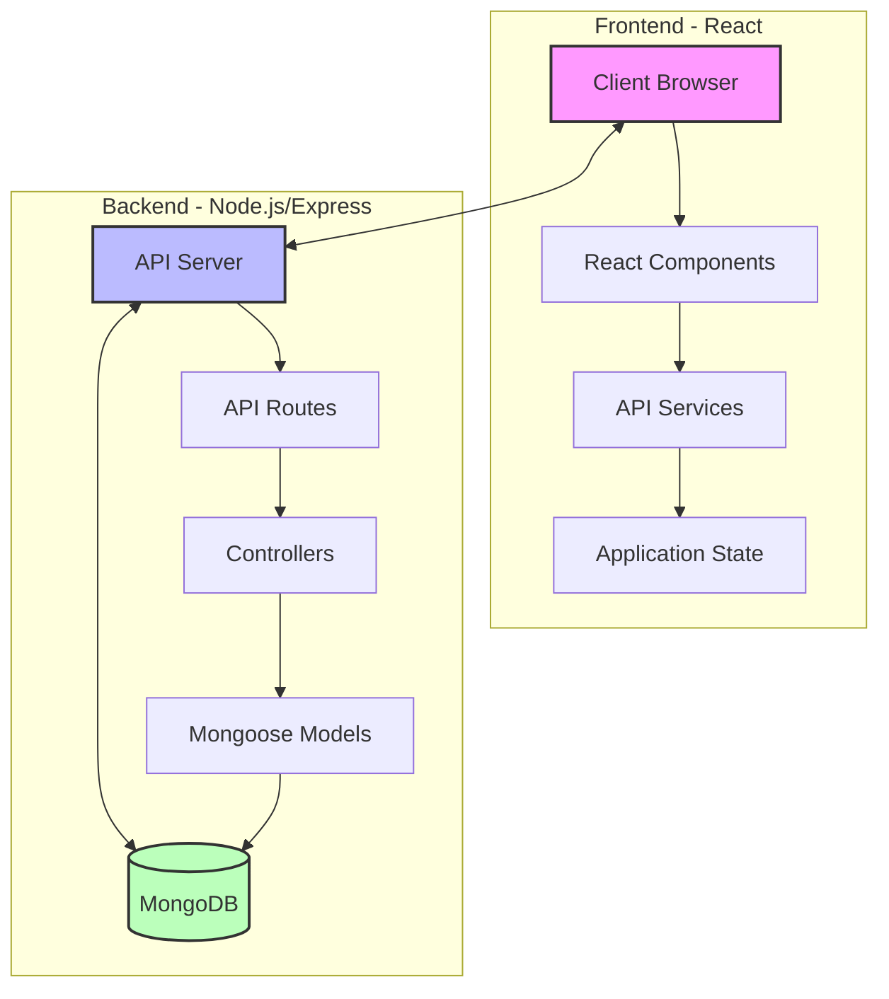
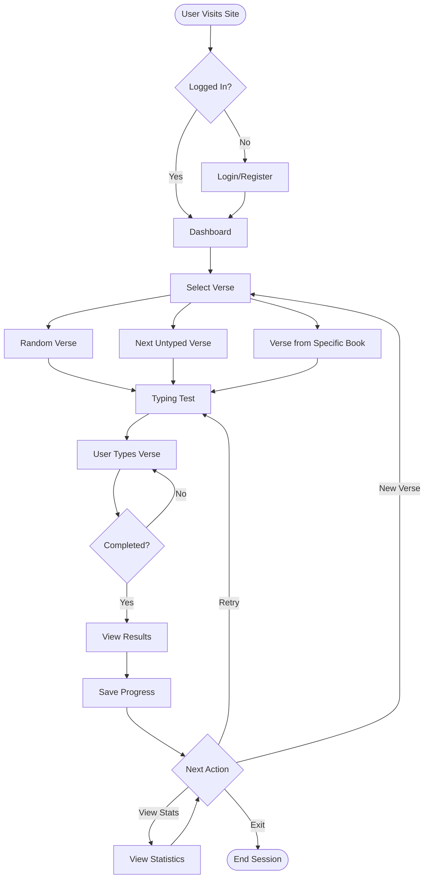
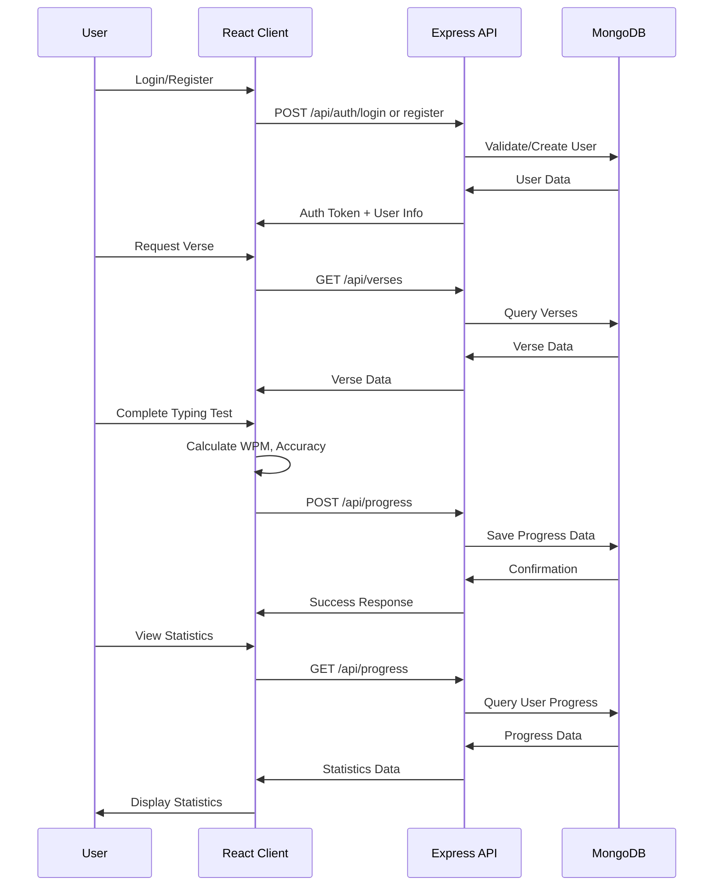
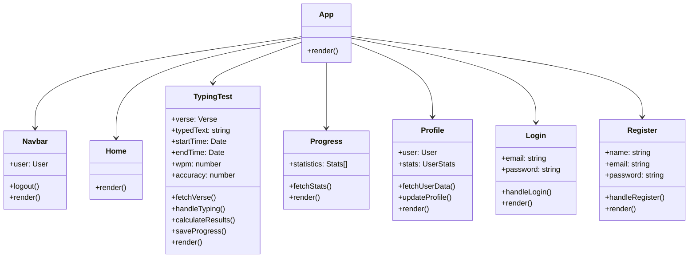

# Type Through The Bible

A web application that helps users improve their typing skills while memorizing Bible verses. This project is inspired by the original "Type Through The Bible" game by Kenneth Burchfiel, but reimagined as a modern web application.

## Project Overview

Type Through The Bible is a full-stack web application that allows users to practice typing Bible verses. The application tracks typing speed, accuracy, and progress over time, providing detailed analytics to help users improve their typing skills while engaging with biblical content.

## Features

- **Bible Verse Typing Practice**: Practice typing with verses from various books of the Bible
- **Real-time Feedback**: Get immediate feedback on typing accuracy and speed
- **Progress Tracking**: Track your typing speed (WPM), accuracy, and overall progress
- **User Accounts**: Create an account to save your progress and track your improvement over time
- **Verse Selection**: Choose verses randomly, sequentially, or from specific books and chapters
- **Detailed Analytics**: View statistics about your typing performance
- **Responsive Design**: Works on desktop and mobile devices

## Application Architecture

### System Architecture



### User Flow



### Data Flow



## Project Structure

The project is organized into two main directories:

- `server`: Backend API built with Node.js, Express, and MongoDB
- `client`: Frontend application built with React and TypeScript

```
project/
├── client/               # Frontend React application
│   ├── src/
│   │   ├── components/   # React components
│   │   ├── services/     # API services
│   │   ├── types/        # TypeScript type definitions
│   │   └── App.tsx       # Main application component
│   └── public/           # Static assets
│
├── server/               # Backend Node.js/Express API
│   ├── src/
│   │   ├── controllers/  # Request handlers
│   │   ├── models/       # Database models
│   │   ├── routes/       # API routes
│   │   └── index.ts      # Server entry point
│   └── tests/            # Server tests
│
├── src/                  # Shared code (if applicable)
└── docs/                 # Documentation
```

## Component Structure



## Getting Started

### Prerequisites

- Node.js (v14 or higher)
- MongoDB (local or Atlas)

### Installation

1. Clone the repository
2. Install dependencies for both server and client:

```bash
# Install server dependencies
cd server
npm install

# Install client dependencies
cd ../client
npm install
```

### Running the Application

#### Development Mode

1. Start the server:

```bash
# From the server directory
npm run dev
```

2. Start the client:

```bash
# From the client directory
npm start
```

3. Open your browser and navigate to `http://localhost:3000`

#### Production Mode

1. Build the client:

```bash
# From the client directory
npm run build
```

2. Start the server in production mode:

```bash
# From the server directory
npm start
```

## API Endpoints

- `GET /api/verses`: Get verses (with filtering options)
- `GET /api/verses/:id`: Get a specific verse
- `POST /api/progress`: Save typing test results
- `GET /api/progress`: Get user progress statistics
- `POST /api/auth/register`: Register a new user
- `POST /api/auth/login`: Login a user

## Technologies Used

### Backend
- Node.js
- Express
- MongoDB
- Mongoose
- TypeScript

### Frontend
- React
- TypeScript
- React Router
- Axios
- CSS3

## License

This project is licensed under the MIT License.

## Acknowledgments

- Inspired by the original "Type Through The Bible" game by Kenneth Burchfiel
- Bible verses provided by public domain sources
